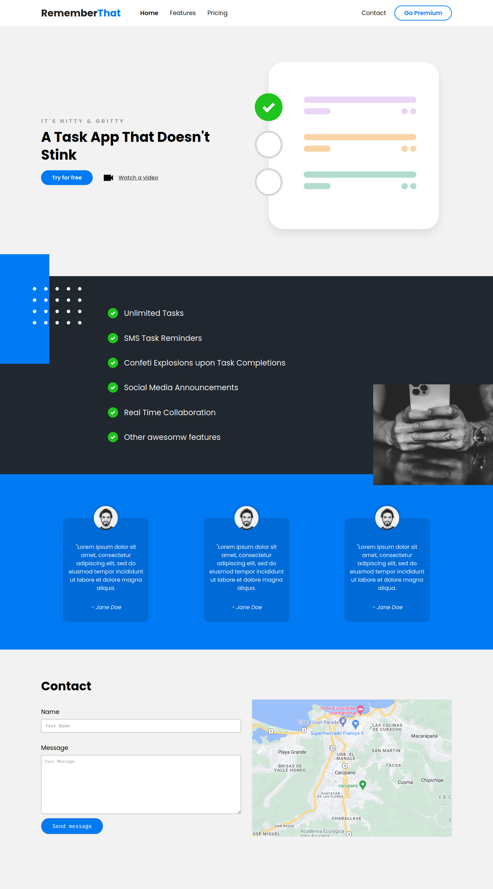

# Rememberthat landing page using vanillajs

Esta es una landing page creada para parcticar mis habilidades usando HTML, Sass y JavaScript.

### Captura de pantalla

## Enlace al Demo del sitio

- Solution URL: [https://rememberthat-landing-page-vanillajs.netlify.app/](https://rememberthat-landing-page-vanillajs.netlify.app/)

## El sitio fue construido con

- HTML5 semántico
- Sass
- Flexbox
- CSS Grid
- JavaScript - usando los módulos de Ecmascript 6
- Flujo de trabajo Mobile-first

## Autor

- Github - [jrag-dev](https://github.com/jrag-dev)